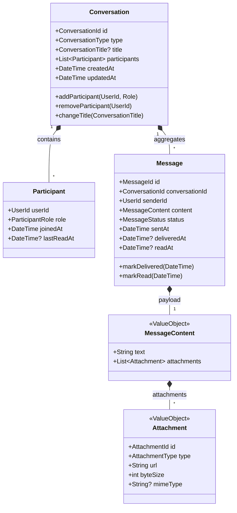

# Domain-Driven Design (DDD) & Clean Architecture Specification

This specification governs the domain modeling, aggregate boundaries, value objects, domain events, repository interfaces, and use-case orchestrations for the Fullstack Chat App.

---

## 1. Domain Modeling: Chat Bounded Context



---

## 2. Value Objects & Invariants

All value objects are immutable, pure Dart objects with explicit validation.

### Example: `MessageContent` Value Object

```dart
// packages/domain_models/lib/src/value_objects/message_content.dart
import 'package:equatable/equatable.dart';
import '../exceptions/domain_exception.dart';

class MessageContent extends Equatable {
  final String text;
  final List<Attachment> attachments;

  const MessageContent._({
    required this.text,
    required this.attachments,
  });

  factory MessageContent.create({
    required String text,
    List<Attachment> attachments = const [],
  }) {
    final trimmed = text.trim();
    if (trimmed.isEmpty && attachments.isEmpty) {
      throw const InvalidMessageContentException('Message cannot be empty.');
    }
    if (trimmed.length > 5000) {
      throw const InvalidMessageContentException('Message exceeds maximum limit of 5000 characters.');
    }
    return MessageContent._(
      text: trimmed,
      attachments: List.unmodifiable(attachments),
    );
  }

  @override
  List<Object?> get props => [text, attachments];
}
```

---

## 3. Aggregate Root: `Conversation`

An aggregate root enforces domain rules and transactional consistency across its sub-entities.

```dart
// packages/domain_models/lib/src/entities/conversation.dart
import 'package:equatable/equatable.dart';
import '../exceptions/domain_exception.dart';
import '../value_objects/conversation_id.dart';
import '../value_objects/user_id.dart';
import 'participant.dart';

class Conversation extends Equatable {
  final ConversationId id;
  final ConversationType type;
  final String? title;
  final List<Participant> participants;
  final DateTime createdAt;
  final DateTime updatedAt;

  const Conversation({
    required this.id,
    required this.type,
    this.title,
    required this.participants,
    required this.createdAt,
    required this.updatedAt,
  });

  bool hasParticipant(UserId userId) {
    return participants.any((p) => p.userId == userId);
  }

  Conversation addParticipant(UserId requesterId, Participant newParticipant) {
    if (type == ConversationType.direct && participants.length >= 2) {
      throw const DomainRuleViolationException('Direct conversations cannot have more than two participants.');
    }
    
    final requester = participants.firstWhere(
      (p) => p.userId == requesterId,
      orElse: () => throw const UnauthorizedDomainActionException('Requester is not a member of this conversation.'),
    );

    if (requester.role != ParticipantRole.admin && requester.role != ParticipantRole.owner) {
      throw const UnauthorizedDomainActionException('Only admins can add participants.');
    }

    if (hasParticipant(newParticipant.userId)) {
      throw const DomainRuleViolationException('User is already in this conversation.');
    }

    return Conversation(
      id: id,
      type: type,
      title: title,
      participants: [...participants, newParticipant],
      createdAt: createdAt,
      updatedAt: DateTime.now().toUtc(),
    );
  }

  @override
  List<Object?> get props => [id, type, title, participants, createdAt, updatedAt];
}
```

---

## 4. Application Layer: Use Cases

Use cases contain application-specific business logic. They orchestrate domain entities and call repository interfaces.

```dart
// packages/domain_models/lib/src/use_cases/send_message_use_case.dart
import 'dart:async';
import '../entities/message.dart';
import '../repositories/i_chat_repository.dart';
import '../value_objects/conversation_id.dart';
import '../value_objects/message_content.dart';
import '../value_objects/user_id.dart';

class SendMessageUseCase {
  final IChatRepository _chatRepository;

  const SendMessageUseCase(this._chatRepository);

  Future<Message> execute({
    required ConversationId conversationId,
    required UserId senderId,
    required String text,
  }) async {
    final content = MessageContent.create(text: text);
    return await _chatRepository.sendMessage(
      conversationId: conversationId,
      senderId: senderId,
      content: content,
    );
  }
}
```

---

## 5. DDD Test-Driven Workflow (Standard Test Suite)

Every domain entity and use case has a corresponding unit test verifying positive and negative business invariants.

```dart
// packages/domain_models/test/use_cases/send_message_use_case_test.dart
import 'package:test/test.dart';
import 'package:mocktail/mocktail.dart';
import 'package:domain_models/domain_models.dart';

class MockChatRepository extends Mock implements IChatRepository {}

void main() {
  late MockChatRepository mockChatRepository;
  late SendMessageUseCase useCase;

  setUp(() {
    mockChatRepository = MockChatRepository();
    useCase = SendMessageUseCase(mockChatRepository);
  });

  test('throws InvalidMessageContentException when text is empty and no attachments', () async {
    final conversationId = ConversationId('conv_123');
    final senderId = UserId('user_456');

    expect(
      () => useCase.execute(
        conversationId: conversationId,
        senderId: senderId,
        text: '   ',
      ),
      throwsA(isA<InvalidMessageContentException>()),
    );

    verifyZeroInteractions(mockChatRepository);
  });
}
```
